# Domain Driven Design

> Domain Driven Design เป็นศาสตร์ที่ช่วยในการออกแบบ Business logic และช่วยหาว่าเราต้องมี Service อะไรบ้างใน Microservices

## Business logic design patterns
- Transaction script
- Domain model
- Aggregate
- Domain event
- Event sourcing (บทที่ 6 เราจะพูดถึง)

## Transaction script pattern

### ลักษณะ
Transaction script pattern คือ Business logic model แบบที่เราคุ้นเคยมากที่สุด โดยมีข้อสังเกตคือมันจะแบ่งให้ Class มี Behavior อย่างเดียวหรือ State อย่างเดียว

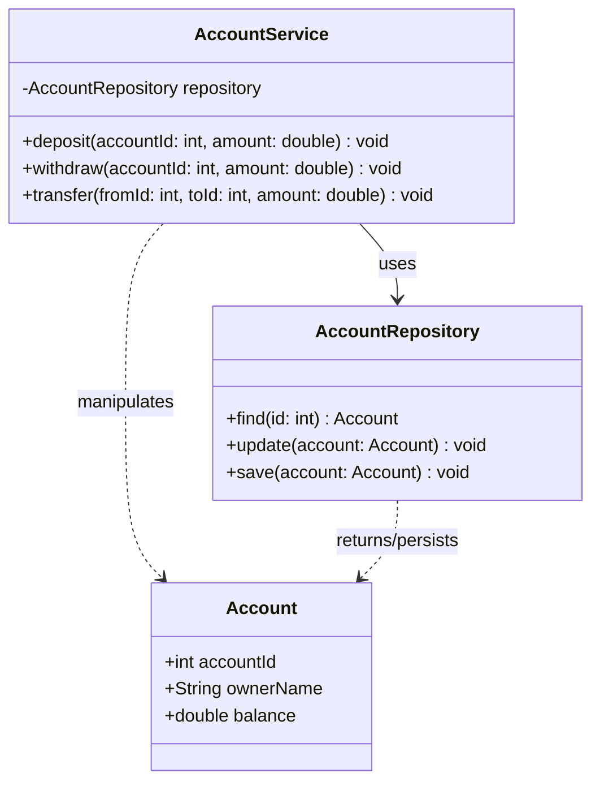

- `AccountService` มีแค่ Behavior
- `AccountRepository` มีแค่ Behavior
- `Account` มีแค่ State ไม่มี Behavior

### ปัญหา
- หาก Business logic ซับซ้อนจะไม่เหมาะสม ได้แก่
  - Big Ball of Mud ยิ่งระบบโตทำให้โค้ดยาวเป็นก้อนโคนยักษ์จนอ่านไม่ออก เช่น Business logic อยู่ในที่ Service หมดเลยที่เดียวทำให้อ่านยาวนาน ตอนแรกโคลนอาจจะไม่โต แต่นานๆ เข้าโคลนก้อนนั้นจะโตขึ้น
  - Duplicated code เกิดการซ้ำซ้อนของโค้ด เช่น

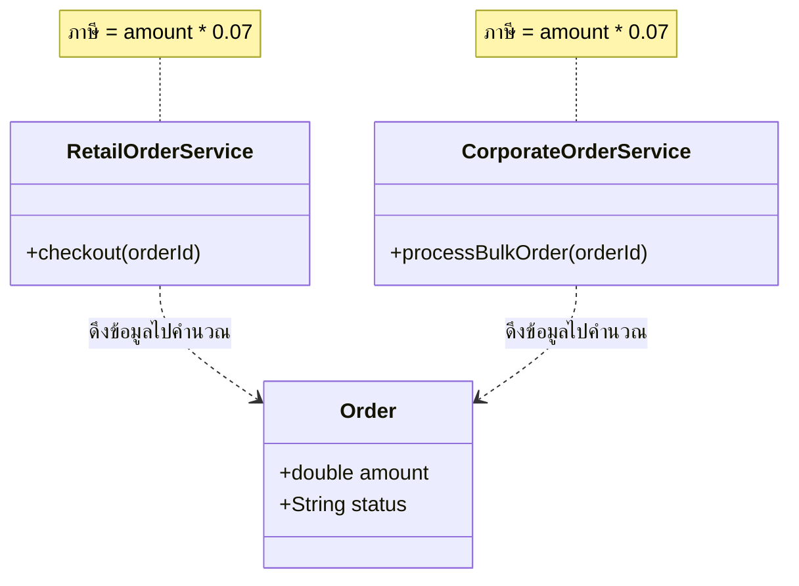
`ภาษี = amount * 0.07` หากอยากแก้เป็น `ภาษี = amount * 0.10` เราต้องแก้ทั้งสอง Service เลย ทางแก้คือเราสามารถทำให้เป็นแบบ

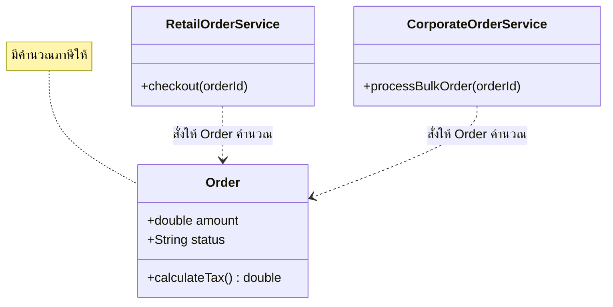
แบบนี้คือเราสามารถแก้การคำนวณภาษีที่จุดเดียว ไม่ต้องแก้สองจุดและนี้แหละคือสิ่งที่ Domain model จะทำให้เราในจุดนี้ และทำให้ Business logic ไม่ไปอยู่ที่ Service's logic แค่จุดเดียว

## Domain model pattern

### ลักษณะ
Domain model pattern คือ Business logic model ที่มี Learning curve สูงเรียนรู้ยาก แต่ทำให้ Business logic ไม่เกิด Big Ball of Mud และ Duplicated code โดยมีข้อสังเกตคือมันจะแบ่งให้ Class มี Behavior อย่างเดียวหรือ State อย่างเดียวหรือมีทั้งสองอย่างเลย

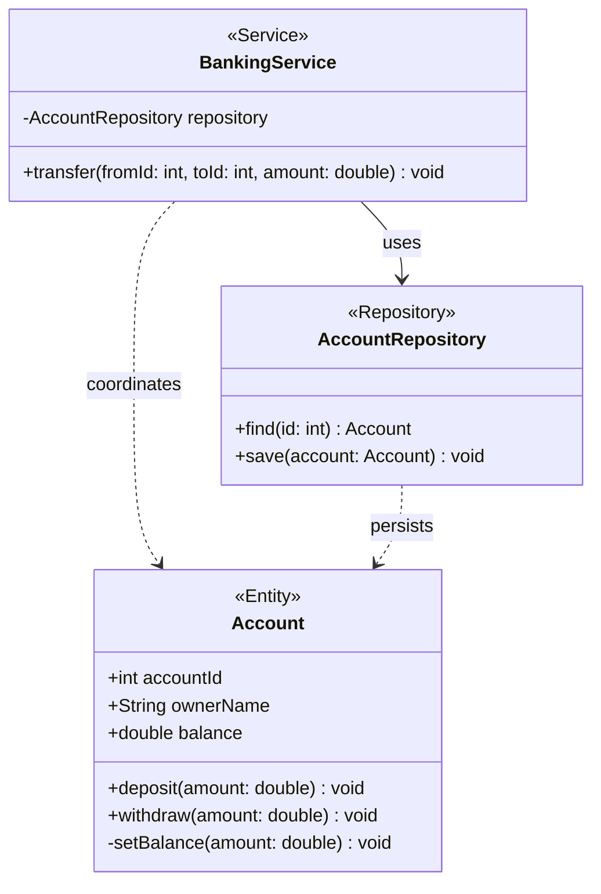

- `Account` มีทั้ง Behavior และ State
- `AccountRepository` มีแค่ Behavior
- `BankingService` มีแค่ Behavior

จุดที่แตกต่างกันคือ `Account`, `AccountService` และ `BankingService` เราย้ายบางอย่างไปอยู่ใน `Account` แทนคือ `deposit()` และ `withdraw()`

### ข้อดี
- แก้ปัญหาที่เกิดใน Transaction script pattern ได้ดี
- ใช้งานในระบบใหญ่ๆ ซับซ้อนได้ดี

### ข้อเสีย
- Learning curve สูง

### Domain-Driven Design (DDD)

DDD ได้มอบรูปแบบของ Domain model เป็นประเภทของ Class ดังต่อไปนี้
1. Entity เป็นคลาสที่มีทั้ง Behavior และ State และ **มี Identity** เช่น id
   - Entity A แม้นจะเหมือน Entity B (id ห้ามเหมือน) แต่ก็ไม่ใช่สิ่งเดียวกัน

เช่น บัญชีเงินฝากนาย A มีเงิน 100 บาท ไม่ใช่สิ่งเดียวกับบัญชีนาย B ที่มีเงิน 100 บาทเท่ากัน
```java
public class Account {
    private final String id;      // Identity
    private String ownerName;
    private Money balance;        // Value Object

    // Constructor
    public Account(String id, String ownerName, Money initialBalance) {
        this.id = Objects.requireNonNull(id);
        this.ownerName = ownerName;
        if (initialBalance.amount() < 0) {
            throw new IllegalArgumentException("Cannot open an account with a negative balance");
        }
    }

    // Entity's Behavior
    public void withdraw(Money amount) throws Exception {
        if (balance.isLessThan(amount)) {
            throw new Exception("Insufficient funds");
        }
        
        this.balance = balance.subtract(amount);
    }

    // Getters
    public String getId() { return id; }
    public Money getBalance() { return balance; }
}
```

2. Value Object (VO) เป็นคลาสที่มีทั้ง Behavior และ State **ไม่มี Identity**
   - Entity A เหมือน Entity B เราสามารถพูดได้ว่า A = B

เช่น เงิน 100 บาท = เงิน 100 บาท
```java
public record Money(long amount, String currency) {
    public Money {
        if (amount < 0) {
            throw new IllegalArgumentException("Amount cannot be negative");
        }
    }

    public Money subtract(Money other) {
        return new Money(this.amount - other.amount(), this.currency);
    }
    
    public boolean isLessThan(Money other) {
        return this.amount < other.amount();
    }
}
```

3. Factory เป็นคลาสหรือเมธอดที่ใช้สร้าง Object จาก Class ต่างๆ เพราะเราจะไม่สร้าง Objectตรงๆ 
   - เพราะอาจจะละเมิด Business Rule ได้ เช่น ตั้งค่าเงินในบัญชีให้ติดลบ
   - เพราะบางครั้งการสร้าง Object มีความซับซ้อนเกินไป จึงต้องมีตัวช่วยสร้าง

4. Repository เป็นคลาสที่ถูกสร้างมาเพื่อบันทึก Entity, Value object ลง Database หรือจะ Query หรือ Update ก็ได้ในคลาสนี้

5. Service เป็นคลาสที่มีแต่ Behavior ที่ไม่ควรจะอยู่ใน Entity หรือ Value Object

## Aggregate pattern

ในช่วงแรกๆ เราจะออกแบบ Domain model แบบคร่าวๆ โดยมีแค่ Entity และ Value object ก่อน ขอยกตัวอย่างการออกแบบในระบบ E-commerce เราสามารถออกแบบ Domain model ได้ดังนี้

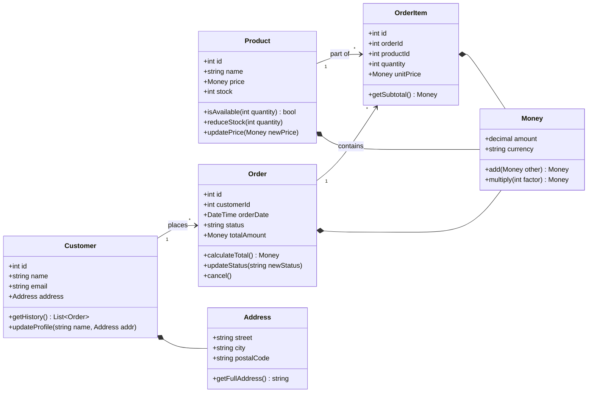

เนื่องจากเราใช้ Microservice เราจึงต้องจัดกลุ่มแบ่ง Sub Domain model ออกเป็นในหลายๆ Service ซึ่ง DDD ได้เรียกกลุ่มของโมเดลพวกนั้นว่า **Aggregate**

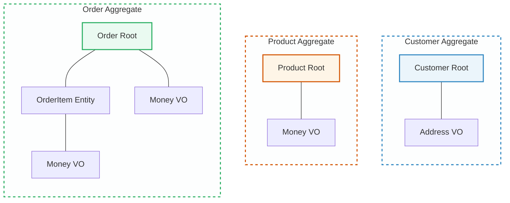
> **Important Note** 📝:
> 
> Aggregate ไม่เท่ากับ Service นะ
>
> 1 Service อาจจะมีหลายๆ Aggregate ก็ได้

### ลักษณะ

> **Important Note** 📝:
>
> **Aggregate pattern** คือการจัดระเบียบ Domain Model ให้อยู่ในรูปแบบของกลุ่มก้อน (Aggregates) โดยที่แต่ละกลุ่มก้อนจะประกอบด้วยชุดของ Object ต่างๆ (Entity, Value object) และจะถูกปฏิบัติหรือจัดการเสมือนว่า**เป็นหน่วยเดียวกัน** (Unit)"
>
> แต่ละ Aggregate ต้องมี Object ตัวแทนที่เรียกว่า **Root** โดยพิจารณาจากตัวที่ใหญ่ที่สุด และเหมาะสมที่จะเป็น Single Entry Point (จุดเข้าทางเดียว) เพื่อ Ref. ไปหา Object อื่นๆ

เช่น จากรูปด้านบนเราจะเรียก Order Aggregate จะเป็นมวลรวมของ Order, OrderItem, Money เป็นต้น

> นอกจากนี้ DDD ยังได้มอบกฎของ Aggregate เพื่อทำให้เกิด Consistency ของข้อมูล

### กฎของ Aggregate
#### Reference ได้แค่ Aggregate root เท่านั้น

ทำไมจึงมีกฏข้อนี้สมมุติว่ามีคลาสดังนี้
- `Account` เป็น **Root** และมี `withdraw()` เพื่อถอนเงินโดยมี Business rule ว่าห้ามถอนเงินเกินยอดเงินที่มี
- `Account` มี `Money` เป็น Value object

หากคุณไม่ยอมใช้ `account.withdraw()` แล้วไปยุ่งกับ `Money` ตรงๆ คุณอาจจะเผลอที่จะละเมิด Business rule โดยการถอนเงินเกินที่มีได้ เป็นต้น

#### Reference ผ่าน Identity เท่านั้น

เราจะไม่ Ref. ด้วย Object แต่จะ Ref. ด้วย Identity เช่น Primary key นั้นก็เพื่อให้เกิด Loose Coupling เช่น `Order` จะ Ref. `Customer` ผ่าน `customerId` เท่านั้น ลองคิดว่า Order service มี Order aggregate และ Customer service มี Customer aggregate หาก Order service จะ Ref. `Customer` แบบ Object หมายความว่ามันก็ต้องมี Customer aggregate ด้วย (หมายถึงก็ต้องเขียนโค้ด Domain model เพิ่มไปอีก)

ปัญหาที่ตามมาคือลองนึกภาพว่า Domain model ของ `Customer` เปลี่ยนความซวยจะบังเกิดคุณต้องเปลี่ยนที่ Order service และ Customer service ทั้งสองที่ ทำให้ลำบากในการแก้ไข

#### มี 1 Transaction ต่อการสร้างหรืออัพเดต 1 Aggregate เท่านั้น

กฎข้อนี้บอกว่าหากเราจะทำการสร้างหรืออัพเดต 1 Aggregate ทำได้แค่ 1 Transaction เท่านั้น ซึ่งดีกับ Saga pattern มากๆ เพราะ Saga pattern มันก็ทำเช่นนั้นอยู่แล้ว อีกทั้งยัง**ทำให้แต่ละ Service เป็นอิสระต่อกัน (Decoupled)** เช่น หาก Aggregate ที่ช้ามากๆ อยู่ใน Transaction เดียวกับ Aggregate ที่เร็วมากๆ จะทำให้ทั้งหมดช้าไปเลย

แต่มันมีประเด็นที่น่าสนใจอยู่เช่น Service บางตัวอาจมีมากกว่า 1 Aggregate

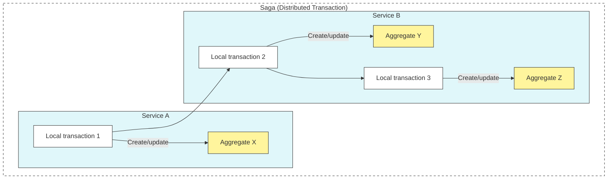

จะเห็นว่า Service B มี Y, Z  เป็น Aggregate ซึ่งจุดนี้จะทำให้เราเขียนโค้ดได้ลำบากขึ้นเพราะต้องปฏิบัติตามกฎของ DDD: Aggregate rule
- **ทางเลือกคนดี** ใช้ Saga pattern แม้นจะใน Service B จะมี Y, Z อยู่แล้วเราก็ต้อง สร้าง/อัพเดต Y แล้วส่ง Message/Event ไปบอกตัวเองให้ทำ สร้าง/อัพเดต Z ต่อไป 
  - ส่งผ่าน Message broker เพื่อความน่าเชื่อถือ เช่น ไฟดับหากไม่เก็บใน Message broker แล้ว Event จะหายไปตลอดกาล
- **ทางเลือกคนฉลาดดี** ถ้ารวม Y, Z เป็น Aggregate เดียวกันได้ก็ดีจบปัญหาเลย
- **ทางเลือกคนเลว** โกงสร้าง/อัพเดต Y, Z ใน 1 Transaction ไปเลย แต่แหกกฎของ DDD: Aggregate rule
  - ข้อดี = ง่าย
  - ข้อเสีย
    - การขยายระบบทำได้ยาก เช่น Y ทำได้เร็วกว่า Z มาก แต่ต้องช้าเพราะผูกใน Transaction เดียวกัน
    - ใช้ NoSql ไม่ได้ เช่น MongoDB สามารถทำ Atomicity แค่ภายใน Document เดียวกัน

## Domain events pattern

### ความหมายของ Event
ในบริบทของ DDD นั้น Domain events หมายถึงเหตุการณ์ที่เกิดขึ้นเมื่อมีการสร้าง/อัพเดต Aggregate 

เช่น Order aggregate สามารถมี Event ได้แก่
- OrderCreated
- OrderCancelled
- OrderShipped
- ...

เป็นต้น

> **Important Note** 📝:
>
> **Domain event pattern**: Aggregate สามารถ publish domain event เมื่อ Aggregate นั้นๆ ถูกสร้างหรือเกิดการอัพเดตที่สำคัญ

### ลักษณะ

เรามาดูว่ามันทำงานอย่างไรกันในตัวอย่างการสร้าง Order แล้วส่ง Event ไปให้ Email Service ส่งอีเมลบอกลูกค้า 

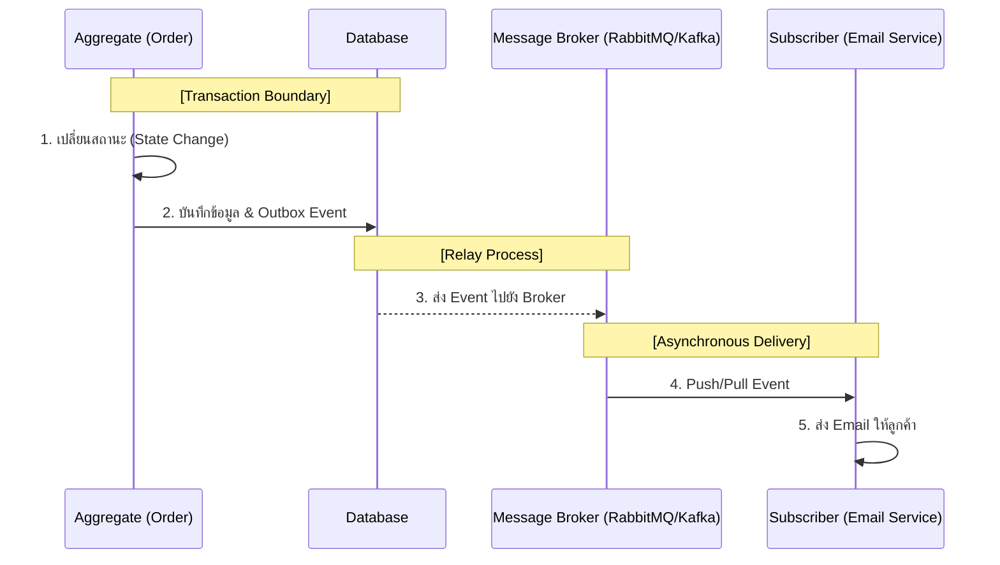

จะเห็นว่าตัวอย่างนี้มีการใช้ **Outbox pattern** (จากบทที่ 2) เพื่อให้การบันทึกข้อมูลและส่งข้อความแบบ Atomic

เรามาดูโค้ดคร่าวๆ กัน

```java
interface DomainEvent {}
```

เราสร้าง Interface ที่มีชื่อว่า `DomainEvent` ทีนี้สิ่งที่เราควรทำต่อมาคือการฝัง Metadata ให้ Event ของเรา

```java
class DomainEventEnvelope<T extends DomainEvent> {
    private String aggregateType;
    private Object aggregateId;
    private T event;
    ...

    // Constructor
    public DomainEventEnvelope (...) {...}
}
```
เราใช้ Generic type T ซึ่งต้อง implement มาจาก Interface `DomainEvent` 

ต่อไปเราจะสร้าง OrderCreated ซึ่งจะ Publish เมื่อมีการสร้าง Order aggregate โดยจะ implement มาจาก Interface `DomainEvent`

```java
class OrderCreated implements DomainEvent {
    private final String orderId;
    private final String customerId;
    private final Double totalAmount;
    private final List<OrderItem> items;
    private final String status;

    // Constructor
    public OrderCreated(String orderId, String customerId, Double totalAmount, List<OrderItem> items, String status) {
        this.orderId = orderId;
        ...
    }

    // Getter Setter
    public String getOrderId() { return orderId; }
    ...
}
```

ตอนนี้เรามี `OrderCreated` เนื่องจาก Event ตัวนี้มันต้องการที่จะถูก Publish เมื่อ Aggregate ถูกสร้างเรามาดูกันว่ามันจะเป็นไง

#### การ Publish Domain event

Order Aggregate

```java
public class Order {
    private final String id;
    private final String customerId;
    private Double totalAmount;
    private OrderStatus status;
    private final List<OrderItem> items;
    // Event's List
    private final List<DomainEvent> domainEvents = new ArrayList<>();

    // Constructor
    public Order(String customerId, List<OrderItem> items) {
        this.id = UUID.randomUUID().toString();
        ...
        
        // Create event
        this.domainEvents.add(new OrderCreated(this.id, this.customerId));
    }

    // Get Events
    public List<DomainEvent> getDomainEvents() {...}

    // Clear Events
    public void clearDomainEvents() {...}

    // Another Getter, Setter
    ...
}
```

สังเกตว่าเราจะสร้าง `private final List<DomainEvent> domainEvents = new ArrayList<>();` มาเก็บ Event ที่สร้างเป็น ArrayList เพราะอาจจะมีหลายๆ Events ได้ และตอนที่ Aggregate ถูกสร้าง (บรรทัดที่ 16 `this.domainEvents.add(...)`) เราก็มีการเอา Event มาเก็บใน Order aggregate ตัวนี้

ในขั้นตอนต่อไปคือการบันทึก Aggregate ลง Database และทำ Outbox pattern กัน

```java
@Service
public class OrderAppService {
    @Autowired
    private OrderRepository orderRepository;

    @Autowired
    private OutboxRepository outboxRepository;

    @Transactional
    public void createOrder(String customerId, List<OrderItem> items) {
        Order order = new Order(customerId, items);

        orderRepository.save(order);

        for (DomainEvent event : order.getDomainEvents()) {
            DomainEventEnvelope<OrderCreated> envelope = new DomainEventEnvelope<>(
                "Order",
                order.getId(),
                event
            );

            outboxRepository.save(envelope);
        }

        order.clearDomainEvents();
    }
}
```

- `class OrderAppService` ซึ่งมันเป็น Application service ไม่ใช่ Domain service ใน Domain model ผมจึงใช้ชื่อ **OrderAppService**
- `orderRepository` ใช้บันทึกข้อมูลลง Order ลง Database
- `outboxRepository` ใช้บันทึก Event ลง Database
- `@Transactional` เราจะทำบันทึก Database ทั้ง Order aggregate และ Event (Outbox) ไปคู่กันใน Transaction เดียวกัน (ตามทฤษฎีบทที่ 2 **Outbox pattern**)
  - บรรทัดที่ 11 `Order order = new Order(customerId, items);` ได้ทำการสร้าง Event ใส่ใน `order.domainEvents` นั้นเอง ซึ่งมันเป็น Private และต้องเรียกผ่าน `order.getDomainEvents()` เท่านั้น
  - จากบทที่ 2 เมื่อบันทึก Event ลง Outbox table แล้ว เราจะให้ Relay ไปอ่าน Outbox table เพื่อส่งข้อความไปให้ Service อื่นๆ

## กลยุทธ์การออกแบบ Service
ในหัวข้อนี้เราจะมาดูวิธีการในการกำหนดออกแบบว่า Microservice ของเราจำเป็นต้องมี Service อะไรบ้าง?

### การรวบรวม Functional requirements
เราจะใช้เทคนิคที่เรียกว่า **User story** ในการสร้าง Functional requirements โดยแต่งนิทาน เช่น

> **ในฐานะ (As a/an)** `Consumer`
> **ฉันต้องการ (I want to)** ที่จะสั่งซื้อสินค้า `Place Order` **เพื่อที่จะ (So that)** `บอกระบบว่าฉันต้องการสินค้าชิ้นไหนบ้าง? และจะได้รู้ยอดชำระ`
>
> - **As a/an** ในประโยคนี้ช่วยให้เราได้คำนามที่น่าจะมีประโยชน์ (อาจจะเอามาเป็นชื่อ Service ภายหลังได้)
> - **I want to** ในประโยคนี้ทำให้เราได้กริยา (อาจจะเอามาเป็น **Systems Operation** ได้) 
> - **So that** ในประโยคนี้ทำให้เราได้ผลลัพธ์ที่จะเกิด และช่วยให้รู้ว่าเป็น Functional requirements ที่จำเป็นขนาดไหน? หรือถ้าไม่สำคัญเลยอาจจะไม่ใช่ Functional requirements เลยก็ได้

#### UML diagram ที่มีประโยชน์
- Use Case Diagram ช่วยให้เราเห็นภาพรวมจาก User story
- Sequence Diagram ช่วยให้เราเห็นกริยาว่าเกิดอะไรขึ้นบ้างจริงๆ เช่น `placeOrder()` ต้องมีการ `addItem()`, `calculateTotal()`, `confirmOrder()` เป็นต้น  

### ออกแบบ Domain model

#### UML diagram ที่มีประโยชน์
- Class Diagram

ออกแบบ Domain model เหมือนที่หัวข้อก่อนๆ แต่คิดแค่ Entity กับ Value Object ไปก่อน เช่น


### การนิยาม Service โดยการ Decompose by subdomain pattern

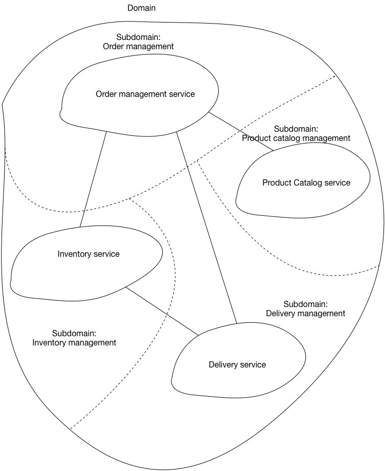

#### Domain คืออะไร?
ก่อนอื่นเราต้องรู้ก่อนว่า Domain model ที่เราได้เรียนรู้ในหัวข้อก่อนๆ นั้นเป็นมุมมอง Solution space ทีนี้ Domain เฉยๆ ที่ยังไม่ได้เอาไปทำโมเดล เป็นมุม Problem space กัน

> **Domain** คือ ปัญหาทั้งหมดที่ธุรกิจ
>
> **Domain Model** คือ วิธีการแก้ปัญหาทางธุรกิจหรือความรู้ต่างๆ ที่ใช้แก้ปัญหา

แต่ปัญหาคือ **Domain** ปัญหาทั้งหมดที่ธุรกิจ มันยากที่จะแก้ได้ง่าย คิดไม่ออก เราจึงแบ่งปัญหาใหญ่ๆ ออกเป็นปัญหาย่อยๆ ที่แก้ง่ายขึ้น เรียกว่า **Subdomain**

**Domain Model** ก็ถูกแบ่งออกเป็น Aggregate ได้เช่นกัน

ตัวอย่างเช่น
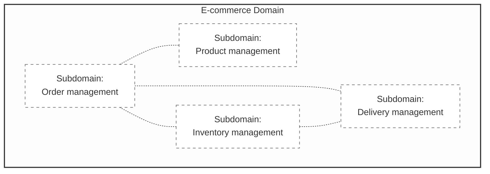

#### Bounded context คืออะไร?

ภาษามนุษย์นี่มันต้องรู้บริบทก่อนถึงจะเข้าใจความหมาย หากไม่รู้บริบทอาจจะไม่รู้ว่าพูดถึงอะไรได้ เช่น Present จะรู้ได้ไงว่าแปลว่าปัจจุบันหรือแปลว่าของขวัญ? มันก็ต้องอาศัยบริบทรอบๆ เพื่อตีความหมายนั้นๆ

ทีนี้เพื่อให้ทุกคนเข้าใจตรงกันจึงต้องจำกัดบริบทไว้ในกรอบๆ หนึ่งเพื่อไม่ให้ไปตีความเป็นอีกความหมายหนึ่งซึ่งเรียกว่า **Bounded context**

เช่น 
- `Account` ในบริบทของ **Banking Service** คือบัญชีเงินฝาก
- `Account` ในบริบทของ **Authentication Service** คือบัญชีที่ใช้ยืนยันตัวตน


> **Important Note** 📝:
> 
> **Bounded context** คือ scope ของ Domain model เพื่อให้แต่ละ Object มีความหมายไม่กำกวม
> 
> **Bounded context ใน Microservice มันคือ Service เลยแหละ**

ดังนั้นขอสรุปว่าการกำหนด Service ใน Microservice สามารถทำได้โดยการสร้าง **Bounded context** และเราจะแมพ Subdomain ไปหา Service เพื่อบอกว่า Service นี้ใช้แก้ปัญหา Subdomain อะไร 

การแมพ Problem space ไปหา Solution space ที่ต้องทำแบบนี้เพราะช่วยให้รู้ว่า Service แก้ปัญหา Subdomain อันไหนได้บ้าง

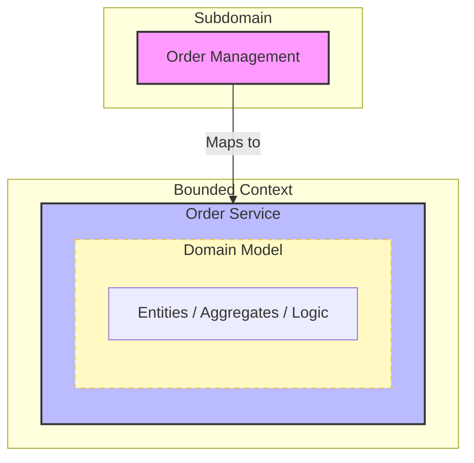
- เท่านี้เราจะได้ Service มาหนึ่งตัวแล้ว
  - ความหมายของการแมพนี้คือ Order Service ใช้แก้ Order Management Subdomain  

> **Important Note** 📝:
> 
> เรื่องที่ควรรู้เกี่วกับ Bounded context
> 
> - เราอาจจะแมพหลายๆ Subdomain ไปหา 1 Bounded context ได้ ไม่จำเป็นว่า 1 Subdomain ต่อ 1 Bounded context
> - การคิด Service (Bounded context) ก็คิดมาแค่ให้มันแก้ได้อย่างน้อยหนึ่ง Subdomain และเลือกชื่อที่มันเหมาะสม
> - แม้นว่าหลายๆ Subdomain ไปหา 1 Bounded context แต่ถ้าเราเอา Subdomain ที่อยู่คนละหน้าที่กันเลยแบบคนละโลกเลย จะได้ Fat Service มาแทน ทำให้ maintenance ยากเพราะโค้ดใหญ่
>   - โดยทั่วไปควร 1 Subdomain : 1 Bounded context

เช่น

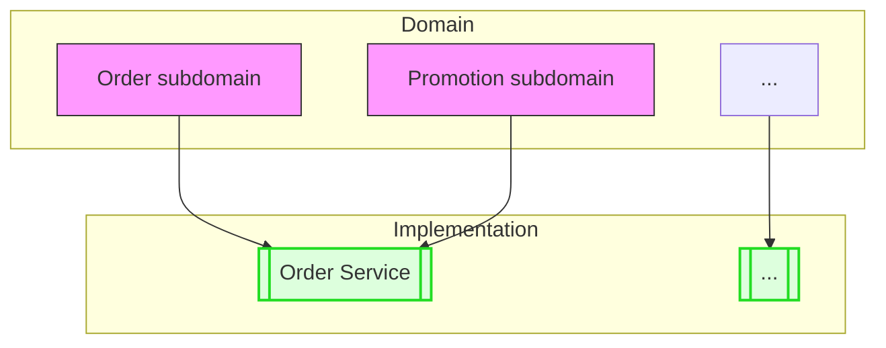

#### Ubiquitous Language
คือ **"ภาษากลาง"** ที่ทุกคนในทีมใช้แบบเดียวกันทั้งทีมธุรกิจและทีมนักพัฒนา เพื่อป้องกันการสื่อสารคลาดเคลื่อน การเขียนโค้ดก็จะใช้ภาษานี้ด้วย

#### คำแนะนำ

1. **Single Responsibility Principle - SRP**

ควรออกแบบ Service ให้มีหน้าที่รับผิดชอบเดียว (High Cohesive) และมีขนาดเล็กพอเหมาะ เพราะทำให้ Maintenance ได้ง่ายกว่า (ทางที่ดี 1 Service ต่อ 1 Subdomain) 

2. **Common Closure Principle - CCP**

หากมีกลุ่ม Services ไหนต้องมีการเปลี่ยงแปลงตามธุรกิจที่เปลี่ยนไปตามกาลเวลา พร้อมกันและเหตุผลในการเปลี่ยนเดียวกัน ควรจับมาอยู่ใน Service เดียวกัน
