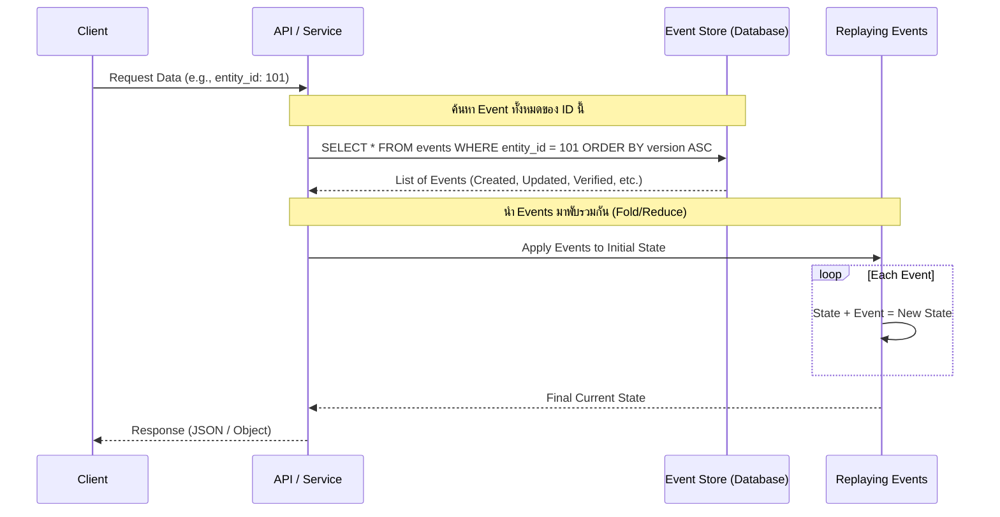
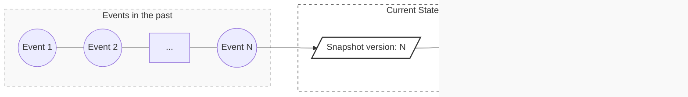

# Event sourcing

> โดยปกติแล้วการบันทึกข้อมูลลงฐานข้อมูลนั้นเราจะบันทึกแค่ค่าปัจจุบันของ Record นั้นๆ แต่ปัญหาที่ตามมาคือเราจะไม่เห็นประวัติเก่าของ Record นั้นๆ ดังนั้น Event sourcing จึงมาแก้ปัญหาดังกล่าว

## ประเภทของการเก็บข้อมูล
1. State-oriented Persistence (การเก็บสถานะปัจจุบัน) เป็นแบบที่เราคุ้นเคยเลยเก็ยสถานะปัจจุบันของข้อมูล แต่ประวัติหายหมด

| account_id | customer_name | balance      | last_updated        | status |
| :--------- | :------------ | :----------- | :------------------ | :----- |
| ACC-001    | Somchai Dee   | **850.00**   | 2024-05-20 10:30:00 | Active |
| ACC-002    | Somsak Range  | **1,200.00** | 2024-05-19 14:15:00 | Active |

2. Event Sourcing (Event-oriented Persistence) เป็นแบบที่เน้นเก็บทุกสถานะของข้อมูลลงในฐานข้อมูล แล้วค่อยนำกลับมารวมกันคำนวณเป็นสถานะปัจจุบันแทน ซึ่งข้อดีคือประวัติยังอยู่

| event_id | account_id | event_type         | amount  | timestamp           |
| :------- | :--------- | :----------------- | :------ | :------------------ |
| 1        | ACC-001    | **AccountOpened**  | 0.00    | 2024-05-20 09:00:00 |
| 2        | ACC-001    | **MoneyDeposited** | 1000.00 | 2024-05-20 09:15:00 |
| 3        | ACC-001    | **MoneyWithdrawn** | 150.00  | 2024-05-20 10:30:00 |
| 4        | ACC-001    | **MoneyWithdrawn** | 200.00  | 2024-05-20 11:00:00 |

ซึ่งสถานะปัจจุบันของ `ACC-001` คือ 0.00 + 1000.00 - 150.00 - 200.00 = **650.00**

## Event sourcing

### ลักษณะ

- Event-oriented Persistence เก็บทุกสถานะแล้วนำมารวมเป็นข้อมูล
- การ Query ข้อมูล Entity เดียวจะทำโดยการนำ Event ที่มี entity_id เดียวกันทั้งหมดมารวมกันเป็นข้อมูลปัจจุบัน (Replaying Events) โดยอาาจะใช้ Loop
  - ถ้านานวันเข้า Events ของ entity_id มีเป็น 1000ๆ Record จะช้า (แก้ได้ปัญหานี้)
- การ Query ข้อมูลหลายๆ Entity ซวยละ ช้ามากๆ เพราะการรวม Events ทั้งหมดไม่ใช่เรื่องง่ายๆ
  - CQRS ช่วยได้เยอะ 
- การ Update ข้อมูลทำโดยการเพิ่ม Events ใหม่ๆ เข้าไป

ตัวอย่างการ Query 1 Entity


### ข้อดี
- Audit Trail ตรวจสอบประวัติเก่งมาก
- นำไปใช้กับ CQRS (บทที่ 4) ได้ดี

### ข้อเสีย
- Learning Curve สูง
- Query แย่ (อาจจะต้องเสียเวลาทำ CQRS)
- มีปัญหาจุกจิกเยอะกว่าการเก็บแค่ State ปัจจุบัน (State-oriented Persistence)

### ปัญหา
#### concurrent updates การมีการการอัพเดตพร้อมๆ กันใน 1 Record
Transaction ไม่ทำงานเหมือนในตอนที่เราทำแบบ State-oriented Persistence ที่เก็บแค่สถานะปัจจุบันเท่านั้นเพราะมันสร้าง Record ใหม่ตลอดนั้นเองแทนการอัพเดต ดังนั้นหากเกิดการอัพเดตพร้อมกันจึงต้องใช้ **optimistic locking** โดยใช้เวอร์ชั่นป้องกันการเขียนพร้อมกัน

```sql
UPDATE AGGREGATE_ROOT_TABLE
SET VERSION = VERSION + 1 ...
WHERE VERSION = <original version>
```
มีการเช็ค `WHERE VERSION = <original version>` เพื่อดูว่ามีคนอื่นตัดหน้าไหม
- ถ้า Version ตรง แสดงว่าสามารถอัพเดตได้
- ถ้า Version ไม่ตรง แสดงว่ามีคนอื่นอัพเดต ข้อมูลในมือล้าสมัย **ห้ามเขียนทับเด็ดขาด**

ขอยกตัวอย่างเพื่อความง่าย
- มีที่นั่ง A1 กำลังว่าง และ Original version เป็น 2
- มี Request X, Y กำลังขอจอง A1 พร้อมๆ กัน เพราะเห็นว่า A1 ว่างอยู่
ขอให้ X เป็นคนที่จอง A1 ได้จริงแล้วกัน
- X เห็นว่า A1 ว่างอยู่ X จะจองเลยบันทึก Event ว่าจอง A1 และเปลี่ยน version เป็น 3
- Y เห็นว่า A1 ว่างอยู่ Y จะจองแต่พอเห็น `WHERE VERSION = <original version>` ไม่ใช่ 2 แต่เป็น 3 จะหยุดอัพเดตทันที
  - ถ้าไม่หยุดระบบจะเห็นว่ามีคนจอง 2 คนเลย

#### การ Publish events มีการข้าม Events (หากใช้ Polling Publisher)
วิธีแบบง่ายๆ คือ Polling การส่ง event ทุกๆ x วินาที
อาจจะมีการข้าม events ได้หากว่ามีการได้หากคุณจะ Publish แบบมีการติดตาม Events ล่าสุดที่ถูก Publish ไปแล้วโดยเช็คตัวที่

```sql
SELECT * FROM EVENTS 
where event_id > ? 
ORDER BY event_id ASC
```

ปัญหาคือ หาก `event_id` = 11 ถูก commit ก่อน `event_id` = 10 แบบนี้แหละจะซวยเพราะระบบจะข้าม `event_id` = 10 ไปเพราะคุณตามแค่หลังจาก Events ล่าสุดเท่านั้น

##### ทางแก้แบบง่าย
Polling การส่ง event ทุกๆ x วินาที แต่สร้าง Column พิเศษมาเช็ค PUBLISHED หาก = 0 ยังไม่ได้ส่ง หาก = 1 ส่งแล้ว 

| event_id | ... | PUBLISHED |
| -------- | --- | --------- |
| 10       | ... | 0         |
| 11       | ... | 1         |

และ Query ให้หาตัวที่ PUBLISHED = 0 

```sql
SELECT * FROM
EVENTS where PUBLISHED = 0 
ORDER BY event_id ASC
```

เมื่อ Publish Event ที่ `PUBLISHED = 0` ให้เปลี่ยนเป็น `PUBLISHED = 1`

##### ทางแก้อีกแบบ ใช้ Transaction log tailing แทน
**เลิก Polling การส่ง event ทุกๆ x วินาที** 

และหันมาใช้ **Transaction log tailing แทน**เแบบในบทที่ 2 เอา Relay ไปอ่าน log ของ Database (ดักจับ log) และเป็นทางเลือกที่ดีกว่าด้วย

**ข้อดี**
- ดีกว่าแบบ Polling Publisher ตรงที่ประสิทธิภาพดีกว่า Polling Publisher เพราะไม่เป็นภาระให้ Database ทำงาน Query events มาให้

#### ต้องระวังข้อความซ้ำ Duplicated message จาก Service อื่นๆ
หาก Service ของเรามีการรับ Message ของ service อื่นต้องระวังข้อความซ้ำ เพราะจะทำให้การสร้าง Event ของเราซ้ำได้เช่นกัน ทางแก้ก็แก้แบบบทที่ 2 คือทำตาราง `PROCESSED_MESSAGES table` และใช้ Transaction บันทึก Event ลง `EVENTS table` และบันทึก Message ที่เข้ามาลง `PROCESSED_MESSAGES table` 

#### Query ช้าหาก Events เริ่มเยอะ

ลองคิดว่าเราจะ Query หา `entity_id` = 10 เริ่มมีเป็นสิบๆ ร้อยๆ Records ดูสิ แบบนี้ทำไง ทางแก้คือการทำ Snapshot เพื่อทำให้ Query ช้า

ขออธิบาย Snapshot ในหัวข้อถัดไปเพราะสำคัญอยู่

### การทำ Snapshot เพื่อประสิทธิภาพ
คงเป็นเรื่องที่ช้าหากเราจะ Replay เป็นร้อยๆ พันๆ Record หากเราทำ Snapshot จะช่วยให้ปริมาณ event ที่ต้อง Replay ลดลงไปได้

การทำ Snapshot


หากคุณทำ Snapshot ที่ N คุณก็แค่ Replay N+1, N+2, ... โดยที่ไม่ต้องไป Replay 1, 2, 3, 4, ..., N-1 ใหม่

โดยการทำ Snapshot คุณสามารถทำโดยการสร้าง `SNAPSHOTS Table` ขึ้นมา

`EVENTS Table`
| event_id | entity_id | entity_type | event_type     | event_data |
| -------- | --------- | ----------- | -------------- | ---------- |
| ...      |
| 7        | 3         | Customer    | CreditReserved | {...}      |
| 8        | 3         | Customer    | AddressChange  | {...}      |
| 9        | 3         | Customer    | NameChange     | {...}      |
| 10       | 3         | Customer    | ...            | {...}      |
| 11       | 3         | Customer    | ...            | {...}      |
| 12       | 3         | Customer    | ...            | {...}      |
| ...      |

`SNAPSHOTS Table`

| event_id | entity_id | entity_type | snapshot_data |
| -------- | --------- | ----------- | ------------- |
| ...      |
| 10       | 3         | Customer    | {"name": ...} |
| ...      |

เท่านี้เวลาคุณ Replay event ก็มาที่ Snapshot จะเห็นว่า N = 10 ดังนั้นคุณก็แค่ Replay 11, 12

## การทำ Event store
ทำได้ 2 วิธี
### ทำด้วยตัวเอง
- ทำ `EVENTS TABLE` เอง
- ทำ Snapshot เอง
- รับมือ Concurrency เอง โดยการทำ Optimistic locking
- ต้องทำกลไกลอ่าน, เขียน Events เอง Replay เอง
- ต้องทำ Publish event เอง

เหนื่อยครับ!

### Event store สำเร็จรูป
- EventStoreDB
- Axon Server (สาย Java / Spring Boot)
- Marten (สาย .NET + PostgreSQL)
- ...

เป็นต้น

บางอันก็ฟรีบางอันก็เสียเงินแต่ข้อดีคือคุณไม่ต้องเสียเวลาในการทำ Event Sourcing เอง

## ความเข้ากันกับ CQRS
- Event Sourcing ทำให้ Query ยาก เลยต้องนำ CQRS มาช่วย
- Event store ตอบโจทย์ CQRS เนื่องจากการ Replay Event เป็นอีกหนึ่งบทบาทที่ทำให้ CQRS ยืดหยุ่นมาก เพราะทำให้ Scaling จำนวนเครื่อง Read, เปลี่ยน Database, ป้องกันความผิดพลาด

