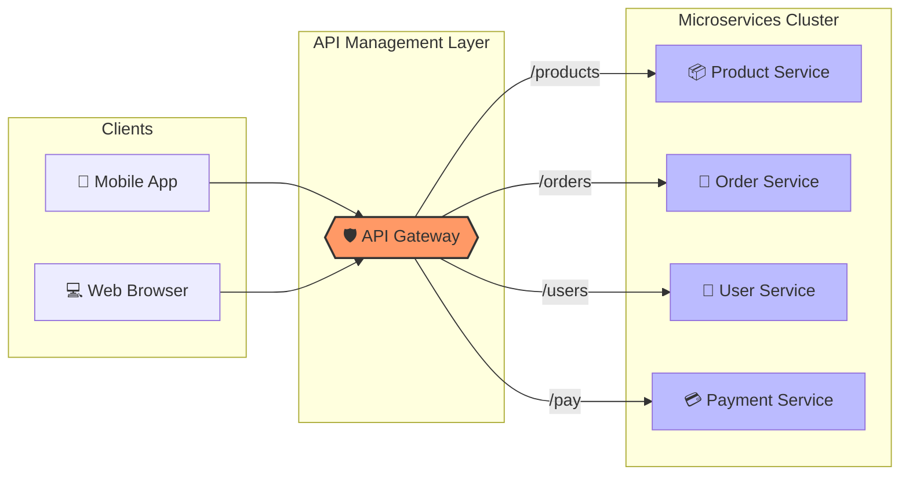
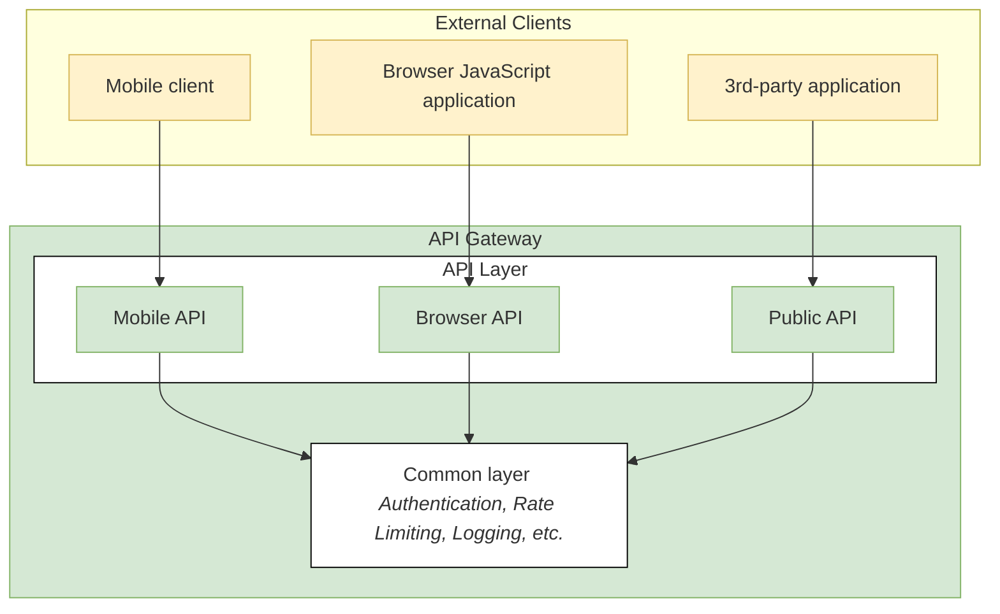
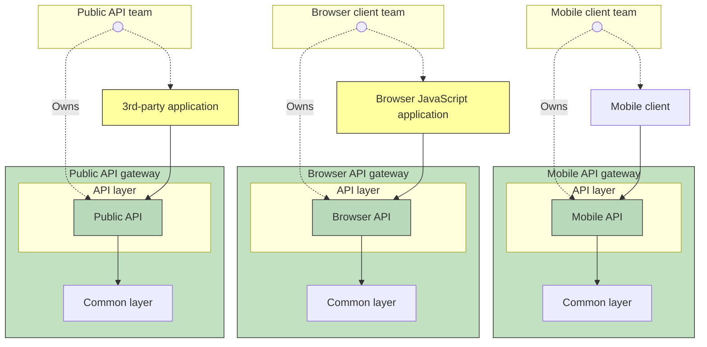
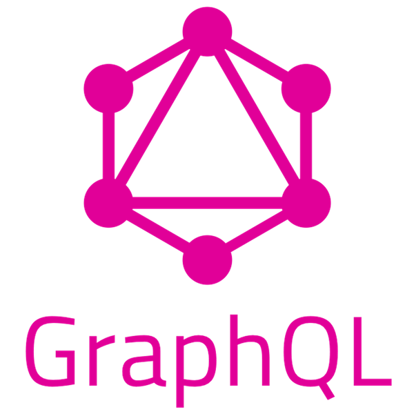

# API Gateway

> มีข้อเสียหากเราให้ Client สื่อสารโดยตรงกับ Service อยู่มากมาย ดังนั้นเรามาดูวิธีแก้ไขมันกัน
>
> ปล. Client ในที่นี้คือ Browser App, Mobile App, Desktop App, ...

## รูปแบบการสื่อสารของ Client
- สื่อสารกับ Service โดยตรง
- การสื่อสารโดยมีตัวกลาง
  - API gateway
  - Backend For Frontend (BFF)

## ประเด็นอื่นๆ

> แต่ละ Client มีความต้องการที่ไม่เหมือนกัน เช่น Mobile app, Browser app ต่างก็มีความต้องการชุดข้อมูลไม่เหมือนกัน เป็นต้น ทำให้ยากที่จะทำ 1 API Composition ที่ Fit-in กับทุกๆ Client 

ดังนั้นบางครั้งเราจึงทำ API Composition (บทที่ 4) แยกกันแต่ละประเภทของ Client ด้วย
เช่น อาจจะมี Mobile API, Browser API โดยเฉพาะแยกตามความต้องการเดี๋ยวเราจะรู้แนวคิดนี้กันอีกที

## สื่อสารกับ Service โดยตรง

#### ข้อดี
- ง่ายไม่ซับซ้อน

#### ข้อเสีย
- หากต้องการให้หลายๆ ข้อมูลที่กระจายไปทั่วๆ Service แล้วจำเป็นต้องส่งหลายๆ Request
  - หากผู้ใช้เน็ตกากจะทำให้เขาหงุดหงิดรอ
  - หากผู้ใช้มาจากมือถือจะเปลืองแบต
- ขาดการ Encapsulation เช่น หาก Service มีการเปลี่ยนแปลงแค่ 1 Service ต้องแก้ทุกๆ Client
- หากใช้ IPC ที่ไม่เป็นมิตรกับ Client อาจทำให้การสื่อสารลำบากขึ้น
  - เช่น หาก Service ที่เราใช้ gRPC แต่ Client มาจาก Web app จะทำไง

## API Gateway

> **Important Note** 📝:
> 
> API Gateway เป็นจุดแรกที่ Client จากภายนอกเข้ามาใน Microservice



### ลักษณะ
- เป็นจุดแรกที่ Client เข้ามา
- Request routing เป็นคนนำพาไปส่งหา Service ต่างๆ
- API composition เช่น การ Query มันจะรวบรวมข้อมูลที่กระจายไปทั่ว Service ต่างๆให้
- เป็นตัวแปล Protocol เช่น Service A ใช้ gRPC ดังนั้น Client จาก Browser app ที่ใช้ HTTPs สามารถคุยกับ Service A ได้เพราะมีคนแปลให้
- มี API layer เพื่อแยก API ให้แต่ละ Client เช่น Mobile app, Browser app, ...
- **(ทางเลือก/ไม่จำเป็น)** มี Function ต่างๆ ได้
  - Authentication/Authorization ยืนยันตัวตน
  - Rate limiting กันคนยิง Request รัวๆ
  - Caching
  - Monitoring
  - Request logging

> จริงๆ เราสามารถทำ Function (Authentication/Authorization, Rate limiting, Caching, ...) ได้สามรูปแบบคือ
> 1. ทำที่ Service ไปเลย (แต่จะดูแปลกๆ เพราะจริงๆ เราควรยืนยันตัวตนที่หน้าบ้านไม่ใช่ในบ้าน)
> 2. ทำ Service พิเศษไปอยู่หน้า API gateway (ข้อเสียคือเพิ่ม Latency เพราะต้องไปที่ service พิเศษ 🡆 API Gateway 🡆 Service เบื้องหลังต่างๆ แต่ข้อดีคือ หากมีหลายๆ Gateway จะทำให้มี Logic อยู่ที่เดียวกันนั้นเอง)
> 3. ทำใน API Gateway ไปเลย (ข้อดีคือ ไม่มี Latency ข้อเสียคือหากมีหลายๆ Gateway จะมี Logic กระจายไปทั่ว)

### สถาปัตยกรรม API Gateway



- **API layer** ใช้แยกแต่ละประเภทของผู้ใช้ เช่น Mobile client, Browser JavaScript application, 3rd-party application
- **Common layer** เป็นชั้นที่ทำ Function พิเศษต่างๆ Authentication, Rate Limiting, Logging, ...
- Client 🡆 API gateway 🡆 Service ต่างๆ

### ประเด็นอื่นๆ
- การมี API Gateway เพียงแค่ 1 อัน ก็มีข้อเสียอยู่ได้แก่
  - ขาดความ Autonomy (ความเป็นอิสระของทีม) เช่น หากทีม Mobile อยากให้ API Gateway เป็นอย่างนั้น แต่ทีม Browser อยากให้เป็นอย่างโน้น ทำให้ความต้องการของแต่ละทีมไม่มีอิสระของตนเอง

### Backend For Frontend

> **Important Note** 📝:
>
> Backend For Frontend Pattern คือการมีหลายๆ API Gateway ตามประเภทของ Client เพื่อให้เกิดความ Autonomy (ความเป็นอิสระของทีม)



- จะเห็นว่าแต่ละทีม Dev สามารถมีอิสระให้กับ API Gateway ของตนเอง ทำให้มี Autonomy (ความเป็นอิสระของทีม) เปลี่ยนแปลงอะไรก็ได้ตามใจทีมตนเอง
  - เช่น สามารถเปลี่ยน **Common layer** ได้ตามใจทีมตนเอง เพื่อให้เหมาะสมกับ API ของตนเอง

> **คำแนะนำ**:
>
> เราควรใช้ API Gateway เป็นตัวเลือกแรก เพราะ BFF นั้นทำให้ระบบซับซ้อนมากขึ้น และใช้ BFF เมื่อแต่ละทีมมีความต้องการ Gateway ไม่เหมือนกันเท่านั้น

### ข้อดี
- Encapsulation ซ่อนความซับซ้อนของ Services ทำให้เวลามีการเปลี่ยนแปลง Services ต่างๆ จะไม่ส่งผลกระทบกับ Client มากนัก
- มอบ API สำหรับ Client โดยเฉพาะ เช่น แยก Browser API, Mobile API, ...
- เป็นทางเข้าแรก ทำให้ Function พิเศษได้ เช่น Authentication, ...

### ข้อเสีย
- ถ้า API gateway ช้า จะทำให้ทั้งระบบช้า เพราะเป็นคอขวด

### ประเด็นอื่นๆ
#### Scalability และ Performance 
API Gate way สามารถทำ I/O ได้สองรูปแบบคือ

- Synchronous I/O (Blocking) 
  - 1 Request = 1 Thread
  - ข้อดี: เขียนโปรแกรมง่าย ตรงไปตรงมา
  - ข้อเสีย: สิ้นเปลืองทรัพยากร
- Asynchronous I/O (Non-blocking)
  - จัดการ Thread ได้ดีกว่า
  - ข้อดี: ไม่สิ้นเปลืองทรัพยากร
  - ข้อเสีย: เขียนโปรแกรมยาก แก้บั๊กยาก

#### การรับมือ Error
- ถ้าทำ API Composition ควรจะทำ Circuit breaker แบบบทที่ 2

#### ทำ Discovery
หากมีการใช้ Synchronous remote procedure invocation  บทที่ 2 ควรจะทำ Discovery Service
- Client-Side Discovery 
- Server-Side Discovery 

## การ Implement API gateway
### สิ่งที่ต้องทำ
1. Request routing พาไปหา Service ที่ต้องการ
2. API composition รวบรวมคำตอบของแต่ละ Service และรวม
3. (Optional) Function พิเศษ เช่น Authentication, Logging, ...
4. (Optional) Protocol translation หากมีการใช้ Protocol ที่ Client ใช้งานได้ยาก
5. (Optional) Discovery  Service

> จะเห็นว่าสิ่งที่ต้องทำเยอะมาก

### ใช้ Off-shelf API Gateway สำเร็จรูป
- ข้อดี: ง่าย แค่ตั้งค่าให้ถูก มี
- ข้อเสีย: ไม่ยืดหยุ่นเพราะต้องใช้ตามที่เขามีมาให้
- เช่น AWS Gateway, Kong, ...

### ใช้ของที่ทำเอง
- ข้อดี: ยืดหยุ่นสูง ทุกอย่างเรากำหนด
- ข้อเสีย: เริ่มได้ช้า ต้องทำทุกอย่างเอง
- เช่น Spring Cloud Gateway, Node.js (Express / Fastify), Go (Gin / Echo), GraphQL

## GraphQL



หัวข้อสุดท้ายบางคร้ังเรามี Clients หลายๆ ประเภทมันคงยากมากๆ ที่จะทำ 1 API ให้ Fit กับทุกๆ Clients ได้ เช่น Mobile Client อาจจะมีความต้องการ Fields ของข้อมูลที่น้อยกว่า เป็นต้น

ปัญหาดังกล่าวสามารถแก้ได้โดย **GraphQL** ทีนี้อยากให้สังเกตที่คำว่า **"QL"** มาจาก Query language นั้นเอง ดังนั้นเจ้าตัวนี้จึงมีความสามารถให้แต่ละ Client เลือก field ข้อมูลที่สนใจเองได้เลย โดยไม่ต้องแยก API ตามแต่ละ Client เหมือนหัวข้อก่อนๆ

เช่น Mobile Client อาจจะเรียกแบบนี้

```graphql
query {
  user(id: "123") {
    name
    avatarUrl
  }
}
```

ขอ User แค่ 2 fields ได้แก่
- name
- avatarUrl

